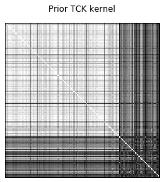
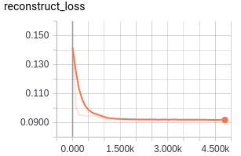
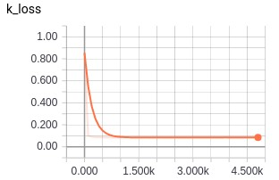
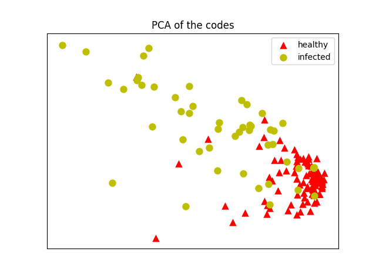

### Deep Kernelized Auto Encoder with Time series Cluster Kernel 
#### Reference paper: [*Learning compressed representations of blood samples time series with missing data*](https://arxiv.org/abs/1710.07547)
------


Tensorflow implementation of a [Deep Kernelized Auto Encoder (dkAE)](https://link.springer.com/chapter/10.1007/978-3-319-59126-1_35), 
aligned with the [Time series Cluster Kernel (TCK)](https://arxiv.org/abs/1704.00794), 
for learning vectorial representations of mutlivariate time series (MTS) with missing data.


The MTS analyzed are blood samples measurements of patient with surgical site infections.
The original dataset is available [at this link](https://groups.google.com/forum/#!topic/ml-news/MQtVkxizrrU).
Here, we consider a subset of 883 MTS divided in 2 classes: superficial infections (651 MTS) and severe infections (232 MTS).
Each MTS has 10 attributes recorded for 20 time steps.
The first 80% of the datasets is used as training set and the rest as test set.

The dataset is located in the folder [Data/](https://github.com/FilippoMB/TCK_AE/tree/master/Data) and consists of 4 files:
* `x.mat` -- training set
* `Y.mat` -- labels of the training set
* `xte.mat` -- test set
* `Yte.mat` -- labels of the test set

------
#### Train TCK (MATLAB)

Run the matlab script [TCK/main.m](https://github.com/FilippoMB/TCK_AE/blob/master/TCK/main.m) to compute TCK on the blood data. 
The TCK parameters are fit on the training data in `x.mat` and then TCK is evaluated on the test data in `xte.mat`.

The computed kernel **K** can be divided in 4 parts: *K_trtr*, the similarities among the elements of the training set, *K_tete*, the similarities among elements of the test set, *K_trte* and *K_tetr*, the similarities between elements of the training set and test set.
The classification of the test set is done on *K_tetr* (or *K_trte*) using a *k*NN classifier, with *k*=1.
In particular, for each row *i* in *K_tetr*, relative to the *i*th test element, we select the column *j*, relative to the *j*th training element.
Then, we assign to the *i*th test element the same label of the *j*th training element.

For example, we get the following classification results on the test set:

```matlab
ACC: 0.86932, F1: 0.7013, AUC: 0.77809
```
A visualization of *K_tete* is also returned.



We can see that the matrix has a block structure: the first larger block on the diagonal are the similarities between MTS of class 1, the second smaller block is relative to the elements of class 2.
Results are saved in [/Data/TCK_data.mat](https://github.com/FilippoMB/TCK_AE/blob/master/Data/TCK_data.mat) and they are used in the next section to train the dkAE.

Due to the stochastic procedure for computing TCK, we repeat the procedure 10 times using random and indepentent initializations.
Hyperparameters selection in TCK is not critical and we always use the default ones (see the original [TCK paper](https://arxiv.org/abs/1704.00794) for details).

------
#### Train the dkAE with TCK (Python)

The dkAE depends on a set of hyperparameters, whose values used in this experiment are specified in the following
* `code_size`: dimension of hidden representations learned by the dkAE (value=20);
* `w_reg`: parameter that weights the L2 regulaziation of the model weights in the loss function (value=0.001);
* `a_reg`: parameter that weights the kernel alignments of the codes inner products with the prior TCK kernel in the loss function (value=0.001);
* `num_epochs`: number of epochs used to train the model (value=5000);
* `batch_size`: size of the mini batches used during training (value=25);
* `max_gradient_norm`: maximum value that gradients are allowed to assume. Values larger than that are clipped (value=1.0);
* `learning_rate`: initial learning rate in the Adam algorithm, used in the gradient descent training procedure (value=0.001);
* `hidden_size` size on the second hidden layer of the encoder and first hidden layer of the decoder (value=30).

The configuration (in terms of procesing units in each layer) of the AE used in the experiments is [200, 30, 20, 30, 200].

To run the whole training and testing procedure, just execute the script [AE.py](https://github.com/FilippoMB/TCK_AE/blob/master/AE.py).
Hyperparameters are set by default at the values described above, but new values can be specified, for example, in this way:
```
python3 AE.py --code_size 5 --w_reg 0.001 --a_reg 0.1 --num_epochs 10000 --max_gradient_norm 0.5 --learning_rate 0.001 --hidden_size 30
```
Additional hyperparameters can be modified within [AE.py](https://github.com/FilippoMB/TCK_AE/blob/master/AE.py). They are listed in the following with the values used in our experiment:

* `dim_red`: computes PCA on the learned code representations of the test set and plots the first two components;
* `plot_on`: show plots at the end of the training (set to 0 for only textual output);
* `interp_on`: interpolate the time series if they have different lengths (not used);
* `tied_weights`: encoder and decoder have tied weights (not used);
* `lin_dec`: the decoder has only linear activations rather than squashing nonlinearities.

```python
dim_red = 1
plot_on = 1
interp_on = 0
tied_weights = 0
lin_dec = 1
```

During the training, the reconstruction loss and the code loss can be visualized in [Tensorboard](https://www.tensorflow.org/get_started/summaries_and_tensorboard). 
The *reconstruction loss* is the MSE error between encoder input and its reconstruction performed by the decoder, while *code loss* is the Frobenious norm of the difference between the prior TCK kernel and the inner products of the codes.




------
#### Learned codes representations of test set and classification

Once the training procedure is over, the dkAE is fed with the MTS of the test set and the relative codes are generated.
The inner products of the codes is visualized and we can notice that the structure resemble the one of the prior TCK shown previously (here we focus on the test part *K_tete*), where the two classes in the test set can be clearly recognized


To have a visualization of the learned representations, we perform PCA and the codes and we plot the first two components. It is possible to see that the 2 classes are well separated



The results returned are the reconstruction MSE and the Pearson correlation between encoder input and decoder output and the accuracy, F1 score and area under ROC curve of the *k*NN classifier with *k*=1
```python
Test MSE: 0.096
Test Pearson correlation: 0.518
kNN: acc: 0.869, F1: 0.716, AUC: 0.792
```
