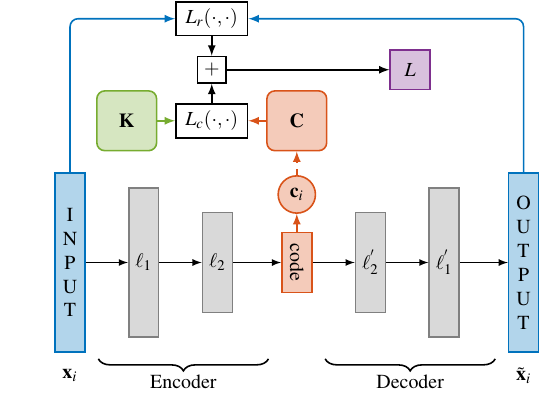

### Deep Kernelized Auto Encoder with Time series Cluster Kernel 
#### Learning compressed representations of blood samples time series with missing data
------



Tensorflow implementation of a [Deep Kernelized Auto Encoder (dkAE)](https://link.springer.com/chapter/10.1007/978-3-319-59126-1_35), 
aligned with the [Time series Cluster Kernel (TCK)](https://arxiv.org/abs/1704.00794), 
for learning vectorial representations of mutlivariate time series (MTS) with missing data.


The MTS analyzed are blood samples measurements of patient with surgical site infections.
The original dataset is available [at this link](https://groups.google.com/forum/#!topic/ml-news/MQtVkxizrrU).
Here, we consider a subset of 883 MTS divided in 2 classes: light infections and severe infections.
Each MTS has 10 attributes recorded for 20 time steps.

The dataset is in the folder [Data/](https://github.com/FilippoMB/TCK_AE/tree/master/Data) and consists of 4 files:
* `x.mat` -- training set
* `Y.mat` -- labels of the training set
* `xte.mat` -- test set
* `Yte.mat` -- labels of the test set

------
#### Train TCK (MATLAB)

Run the matlab script [TCK/main.m](https://github.com/FilippoMB/TCK_AE/blob/master/TCK/main.m) to compute TCK on the blood data. 
TCK is first trained on the training data in `x.mat` and then used to classify the test data in `xte.mat` using a *k*NN classifier, with *k*=1. For example, we get the following classification results on the test:

```matlab
ACC: 0.86932, F1: 0.7013, AUC: 0.77809
```
The computed kernel **K** can be divided in 3 parts: *K_trtr*, the similarities among the elements of the training set, *K_tete*, the similarities among elements of the test set, *K_trte* the similarities between elements of the training set and test set. A visualization of *K_tete* is returned.


We can see that the matrix has a block structure: the first larger block on the diagonal are the similarities between MTS of class 1, the second smaller block is relative to the elements of class 2.
The script saves the results in [/Data/TCK_data.mat](https://github.com/FilippoMB/TCK_AE/blob/master/Data/TCK_data.mat).
